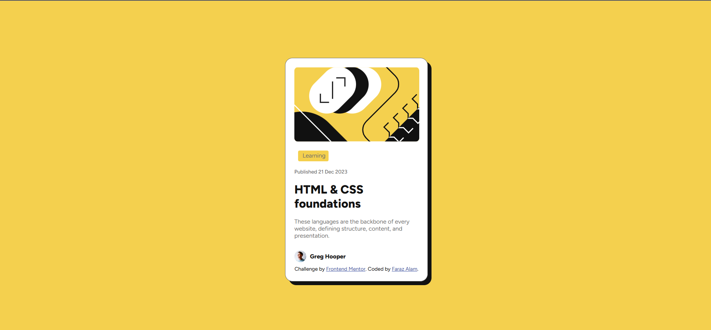

# Frontend Mentor - Blog preview card solution

This is a solution to the [Blog preview card challenge on Frontend Mentor](https://www.frontendmentor.io/challenges/blog-preview-card-ckPaj01IcS). Frontend Mentor challenges help you improve your coding skills by building realistic projects.

## Table of contents

- [Overview](#overview)
  - [The challenge](#the-challenge)
  - [Screenshot](#screenshot)
  - [Links](#links)
- [My process](#my-process)
  - [Built with](#built-with)
  - [What I learned](#what-i-learned)
  - [Continued development](#continued-development)
  - [Useful resources](#useful-resources)
- [Author](#author)
- [Acknowledgments](#acknowledgments)

## Overview

### The challenge

Users should be able to:

- See hover and focus states for all interactive elements on the page

### Screenshot

##### Desktop Version

##### Mobile Version 

### Links

- Solution URL: [Add solution URL here](https://your-solution-url.com)
- Live Site URL: [Add live site URL here](https://your-live-site-url.com)

## My process

### Built with

- Semantic HTML5 markup
- CSS custom properties
- Flexbox
- CSS Grid
- Mobile-first workflow

### What I learned

In this challenege i learn following things:-

- how to porperly arrange file structure
- how to write css in efficient manner
- using color property effectively to make UI look good
- how to apply box shadows on elements.
- how to make UI responsive using media queries

```html
<h1>Some HTML code I'm proud of</h1>
```

```css
:root {
  --Yellow: hsl(47, 88%, 63%);
  --White: hsl(0, 0%, 100%);
  --Gray-500: hsl(0, 0%, 42%);
  --G
}
@media (max-width: 375px) {
  .card {
    max-width: 327px;
    /* padding: 16px; */
  }
}
```

### Continued development

I am still struggling to identify how to arrange different section effectively as per the given design guide. In future project will try to improve effectively.

### Useful resources

- [Google](https://www.google.com) - This helped me for XYZ reason. I really liked this pattern and will use it going forward.

## Author

- Website - [faraz alam](https://personal-portfolio-farazalam.vercel.app/)
- Frontend Mentor - [farazalam2017](https://www.frontendmentor.io/profile/farazalam2017)

## Acknowledgments

First and foremost, I thank Allah, who has blessed me with a good life, wonderful parents, and a supportive environment to learn and grow through all the ups and downs of life. Remember, all of us are destined to leave this world one day. Before that day comes, strive to do something meaningful — something that makes those who remain proud and benefits humanity. Let the tree you plant bear sweet fruits for others, and may you be remembered with a smiling face in the hereafter. A special thanks to the person who created such a wonderful platform for helping us practice and improve ourselves.
